# **DENTAL CLINIC MANAGEMENT SYSTEM - ARCHITECTURE & FLOW**

## **SYSTEM OVERVIEW**

### **🏥 Project Summary**
A comprehensive dental clinic management system with AI-powered treatment suggestions, role-based access control, and modern UX/UI design inspired by Corona React template.

### **👥 User Roles**
- **Admin**: System management, user control, financial oversight
- **Doctor**: Patient care, AI-assisted diagnosis, treatment recording

### **🎯 Core Objectives**
1. Streamline clinic operations and patient management
2. Provide AI-powered treatment suggestions from dual sources
3. Maintain professional medical-grade security and compliance
4. Deliver modern, intuitive user experience

---

## **SYSTEM ARCHITECTURE DIAGRAM**

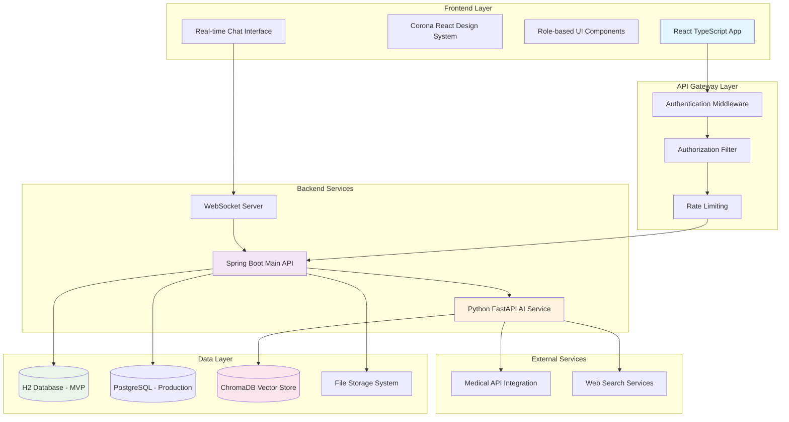

---

## **DETAILED COMPONENT ARCHITECTURE**

### **Frontend Architecture**
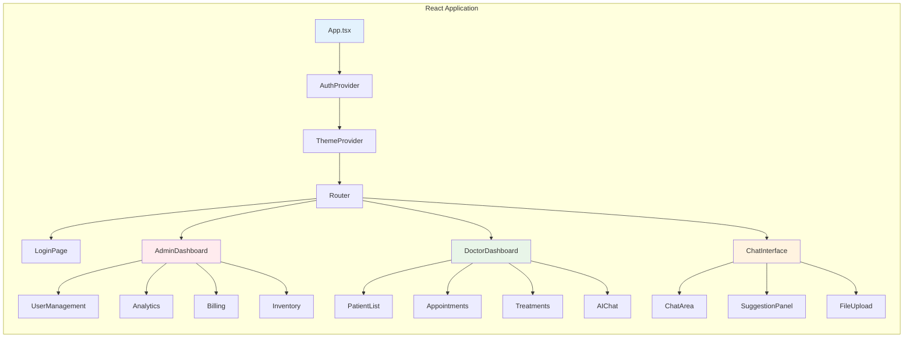

### **Backend Architecture**
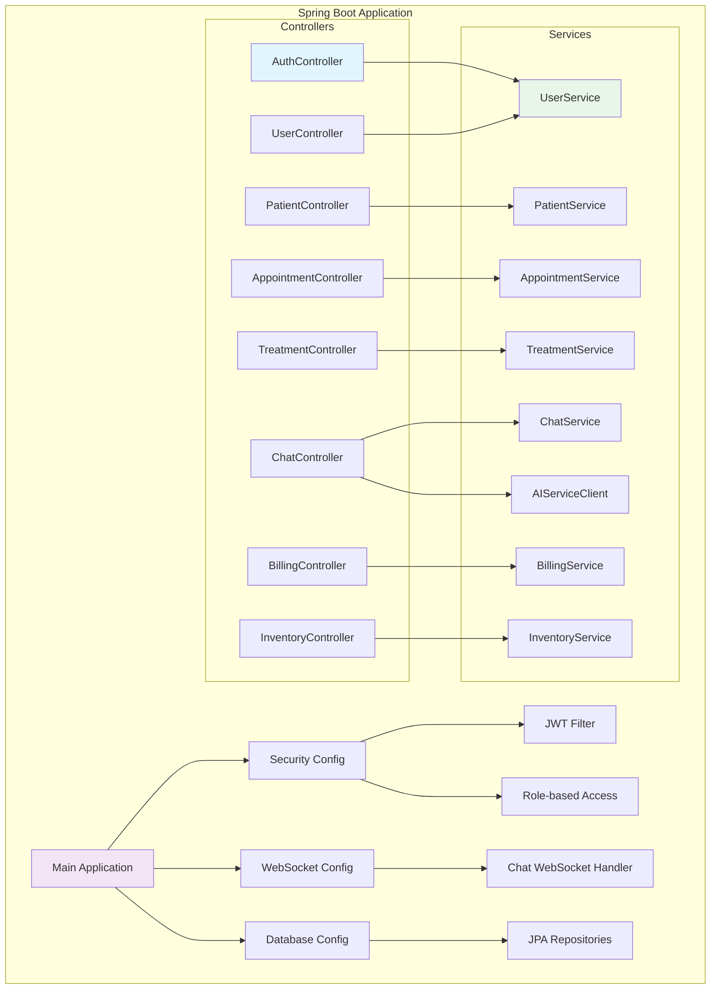

### **AI Service Architecture**
```mermaid
graph TB
    subgraph "Python FastAPI Service"
        A[FastAPI Application]
        A --> B[Authentication Middleware]
        A --> C[Rate Limiting]
        
        subgraph "API Endpoints"
            D[/clinic-suggestions]
            E[/web-suggestions]
            F[/train-model]
            G[/health-check]
        end
        
        subgraph "AI Services"
            H[Medical NLP Service]
            I[Vector Search Service]
            J[Web Scraping Service]
            K[Model Training Service]
        end
        
        subgraph "Data Processing"
            L[Text Preprocessing]
            M[Symptom Extraction]
            N[Treatment Matching]
            O[Confidence Scoring]
        end
        
        D --> H
        D --> I
        E --> J
        F --> K
        
        H --> L
        H --> M
        I --> N
        I --> O
    end
    
    subgraph "Vector Database"
        P[(ChromaDB)]
        Q[Treatment Embeddings]
        R[Medical Knowledge Base]
        S[Patient Similarity Index]
    end
    
    I --> P
    K --> P
    P --> Q
    P --> R
    P --> S
    
    style A fill:#fff3e0
    style H fill:#f3e5f5
    style P fill:#fce4ec
```

---

## **DATABASE SCHEMA DESIGN**

### **Core Tables Structure**
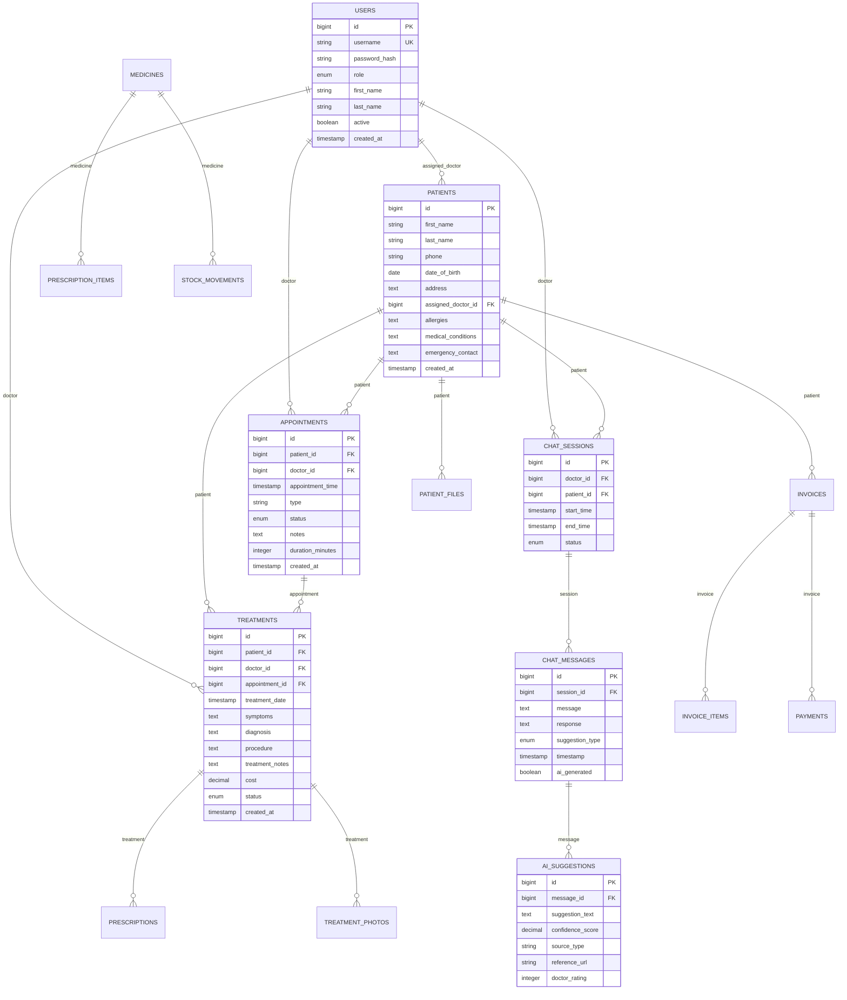

---

## **USER EXPERIENCE FLOW DIAGRAMS**

### **Admin User Journey**
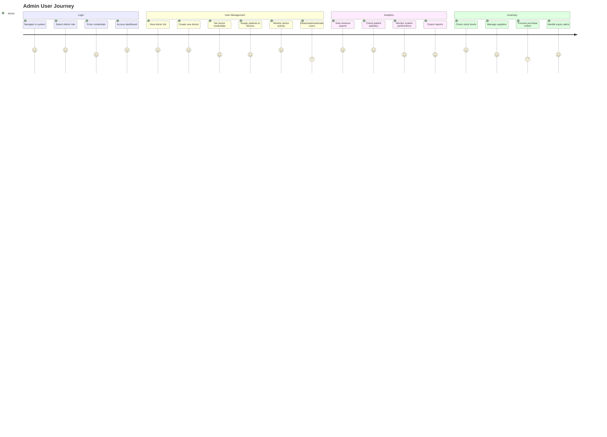

### **Doctor User Journey**
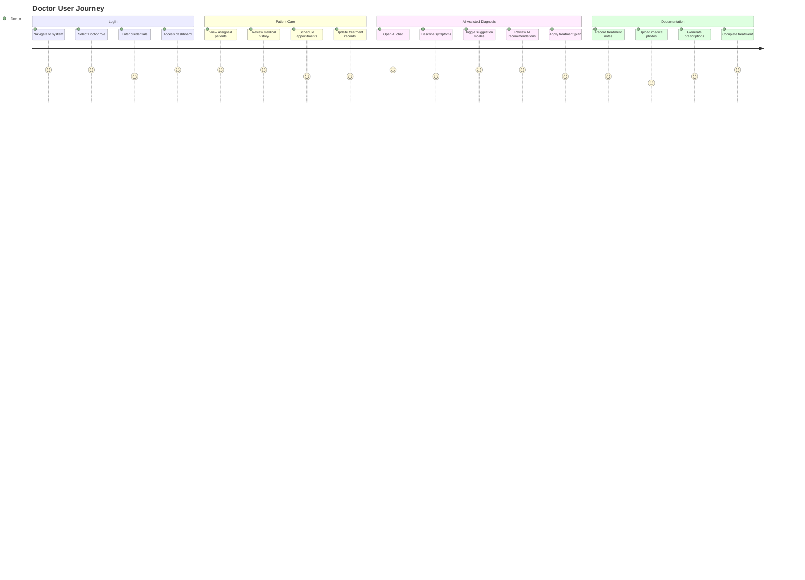

### **AI Chat Interface Flow**
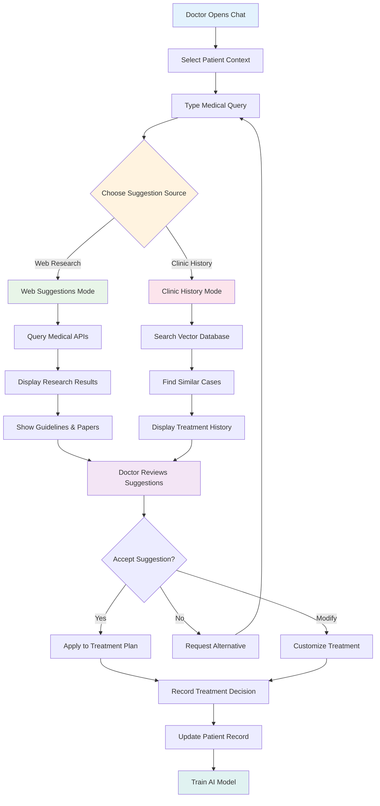

---

## **AI FEATURES DETAILED FLOW**

### **Dual Suggestion System Architecture**
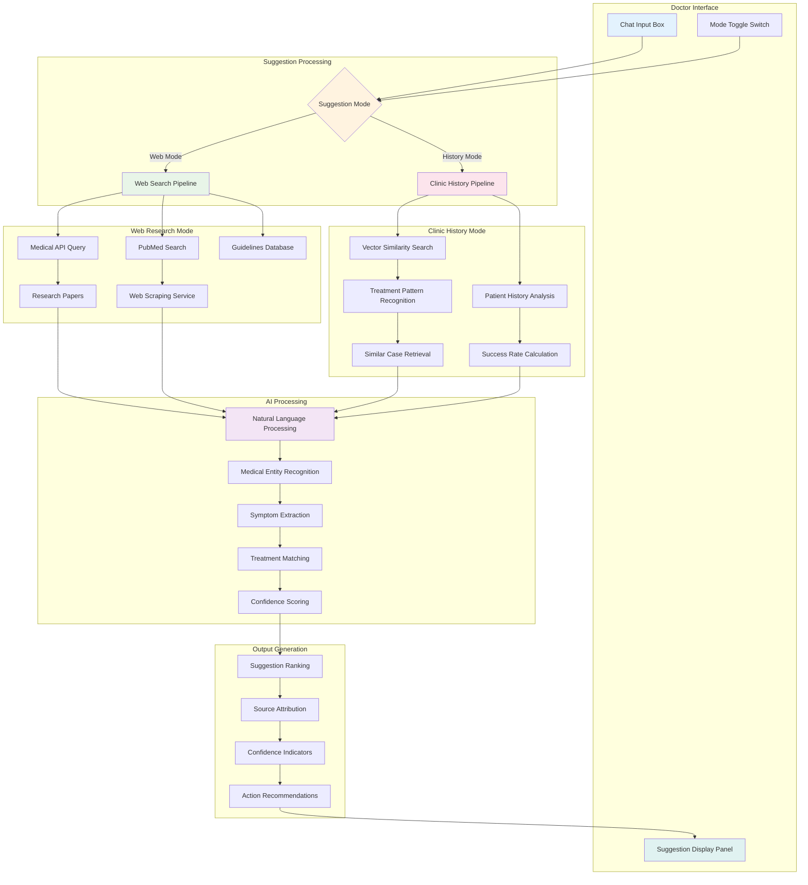

### **AI Training and Learning Loop**
```mermaid
flowchart LR
    A[Treatment Records] --> B[Data Anonymization]
    B --> C[Text Preprocessing]
    C --> D[Feature Extraction]
    D --> E[Vector Embeddings]
    E --> F[ChromaDB Storage]
    
    G[Doctor Feedback] --> H[Rating Collection]
    H --> I[Suggestion Improvement]
    I --> J[Model Retraining]
    J --> F
    
    K[Patient Outcomes] --> L[Success Tracking]
    L --> M[Pattern Analysis]
    M --> N[Algorithm Optimization]
    N --> J
    
    F --> O[Similar Case Matching]
    O --> P[Treatment Suggestions]
    P --> Q[Doctor Interface]
    Q --> G
    
    P --> R[Treatment Application]
    R --> K
    R --> A
    
    style A fill:#e3f2fd
    style F fill:#fce4ec
    style G fill:#fff3e0
    style J fill:#f3e5f5
    style Q fill:#e8f5e8
```

---

## **SECURITY AND COMPLIANCE ARCHITECTURE**

### **Security Layers**
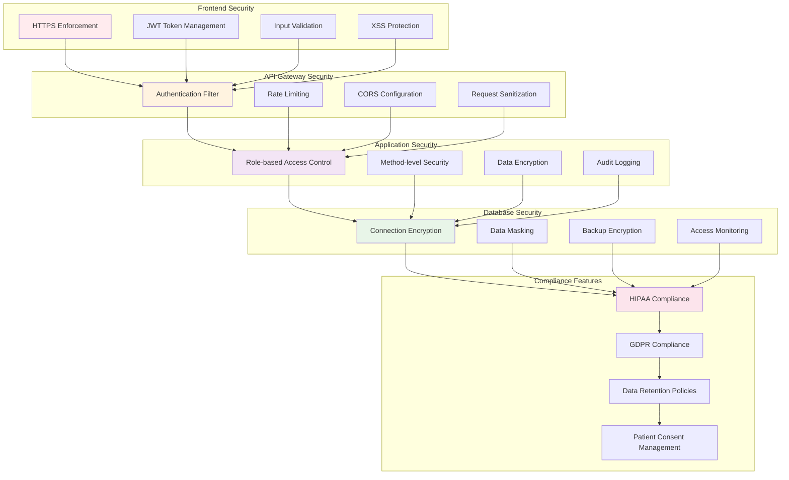

---

## **DEPLOYMENT ARCHITECTURE**

### **Development to Production Pipeline**
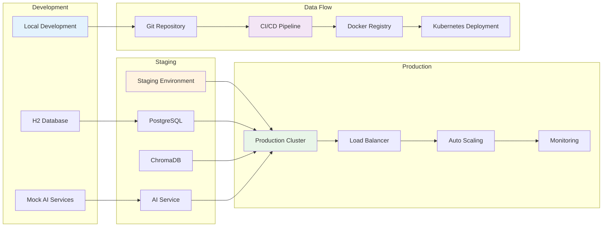

### **Container Architecture**
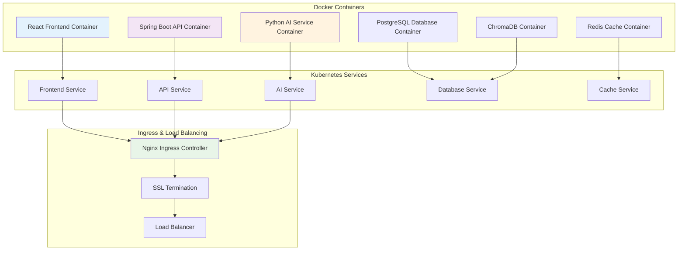

---

## **PERFORMANCE OPTIMIZATION STRATEGY**

### **Frontend Optimization**
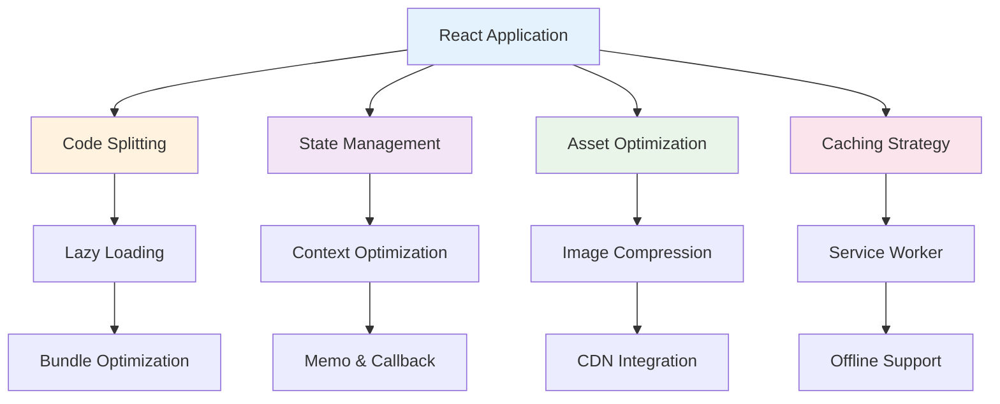

### **Backend Optimization**
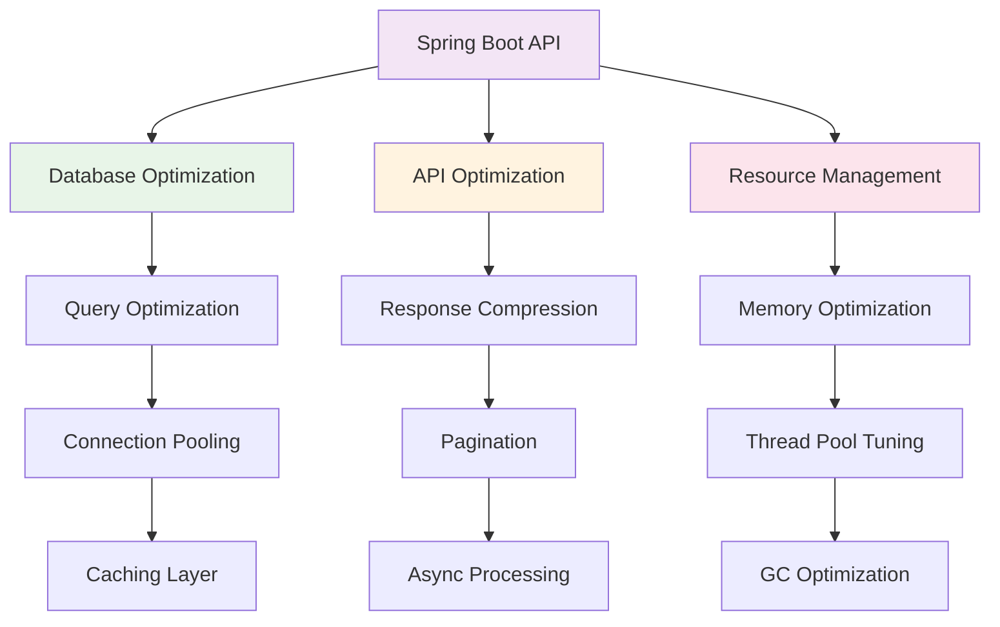

---

## **MONITORING AND ANALYTICS**

### **System Monitoring Dashboard**
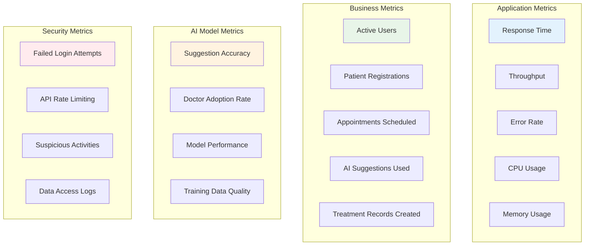

---

## **ADMIN DOCTOR MANAGEMENT WORKFLOW**

### **Add New Doctor Process Flow**
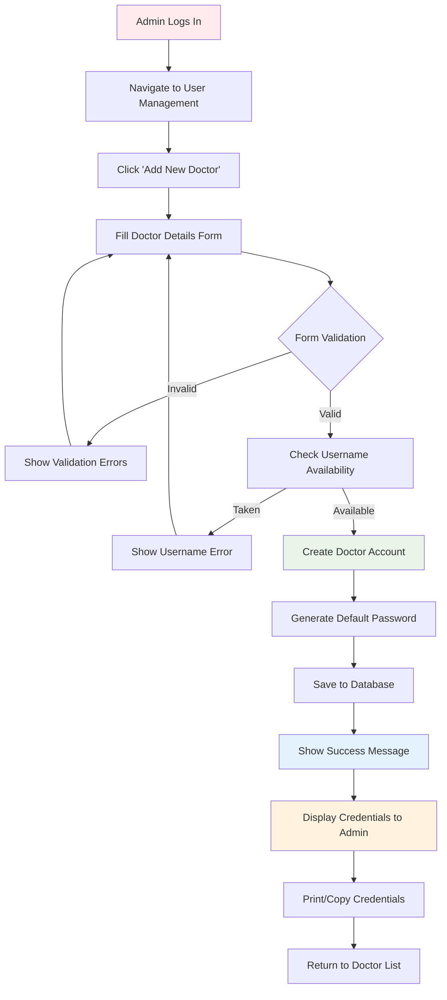

### **Doctor Management Features**
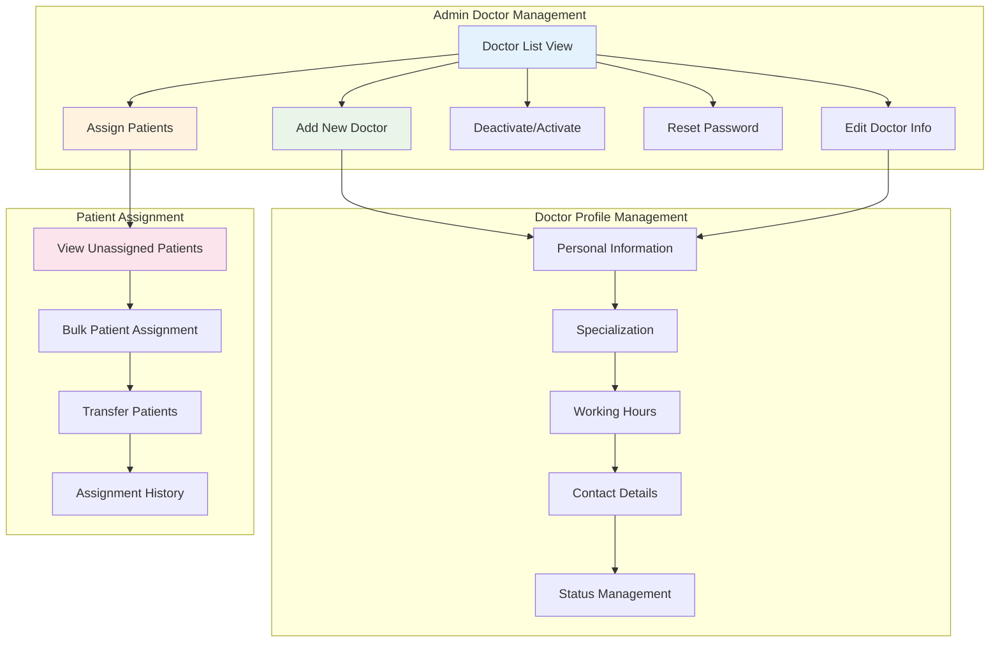

### **User Management Security Model**
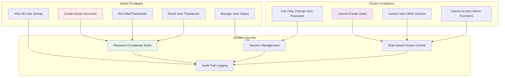

---

## **SIMPLIFIED FEATURES (NO EMAIL/SMS/PAYMENTS)**

### **Removed Features:**
❌ Email notifications and confirmations
❌ SMS reminders and alerts  
❌ Credit card payment processing
❌ Payment gateway integrations
❌ Email-based password reset
❌ Email appointment confirmations

### **Alternative Implementations:**
✅ **In-app notifications** instead of email
✅ **Dashboard alerts** instead of SMS
✅ **Cash/Check/Bank transfer** tracking only
✅ **Manual password reset** by admin
✅ **Phone-based** appointment confirmations
✅ **Printed receipts** instead of email receipts

### **Simplified Billing Workflow:**
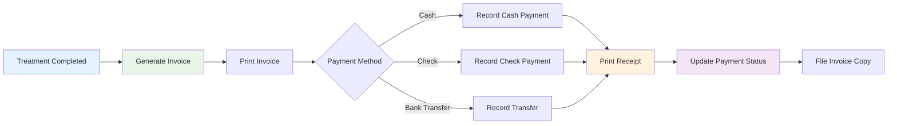

This comprehensive architecture document provides the complete blueprint for developing your dental clinic management system with all the UX/UI flows, AI features, and technical details needed for successful implementation! 🚀